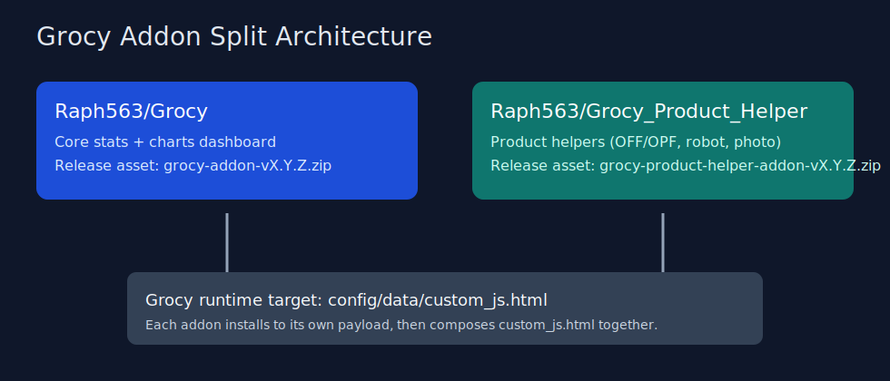

# Grocy Product Helper

Grocy Product Helper is a dedicated Grocy addon focused on product workflows:
- OFF/OPF barcode lookup
- barcode robot (auto create in Grocy)
- product photo search/import
- product-form helpers and status terminal

This repository is the product-tools split from the Stats/Charts line.
The analytics dashboard remains in: https://github.com/Raph563/Grocy

## What You Get

- Addon payload: `addon/dist/custom_js.html`
- Install/update scripts (Windows + Linux/macOS)
- Docker sidecar installer
- GitHub release workflow (stable + alpha)
- Ready-to-run VPS update command path

## Architecture



## Quick Start

### Local install (Windows)

```powershell
cd addon\scripts
.\install.ps1 -GrocyConfigPath "C:\path\to\grocy\config"
```

### Local install (Linux/macOS)

```bash
cd addon/scripts
./install.sh /path/to/grocy/config
```

### Update from GitHub release

Windows:

```powershell
cd addon\scripts
.\update-from-github.ps1 -GrocyConfigPath "C:\path\to\grocy\config"
```

Linux/macOS:

```bash
cd addon/scripts
./update-from-github.sh --config /path/to/grocy/config
```

## Docker Sidecar

Use the included sidecar to inject `custom_js.html` into Grocy config:

```bash
cd addon/docker-sidecar
docker compose -f docker-compose.example.yml up --build
```

The sidecar writes state to:
- `config/data/grocy-product-helper-state.json`

## VPS Pattern (Contabo/Ubuntu)

1. Pull latest release in your repo path.
2. Run update script in container/startup pipeline.
3. Restart Grocy container if needed.

Example updater service can use:

```bash
cd /opt/grocy/services/nerdstats
# adapt to your helper service path
```

## Release Artifacts

Tag format:
- stable: `vX.Y.Z`
- prerelease: `vX.Y.Z-alpha.N`, `vX.Y.Z-beta.N`

Expected zip asset name:
- `grocy-product-helper-addon-vX.Y.Z.zip`

## Repository Split

- `Grocy` repo: stats/charts core
- `Grocy_Product_Helper` repo: product workflow tools

If you need both on one instance, run one payload at a time in `config/data/custom_js.html`.

## Documentation

- FR: `docs/README.fr.md`
- EN: `docs/README.en.md`
- Addon pack docs: `addon/README.fr.md`, `addon/README.en.md`

## License

Project follows the same license policy as the main Grocy addon line in your GitHub org.
